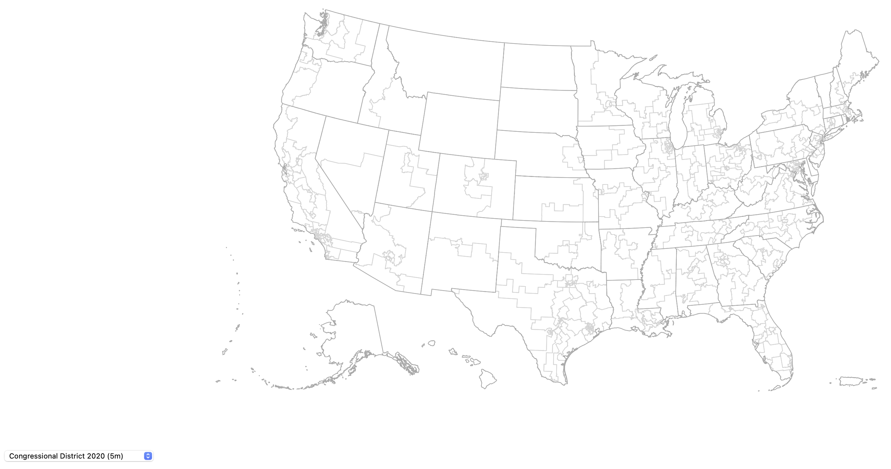

# USA states + territories from SHP to TOPOJSON 

This repository contains scripts that will convert [US Census cartographic
  boundary](https://www.census.gov/geographies/mapping-files/time-series/geo/carto-boundary-file.html)
  shapefiles to lightweight topojson files, which include all 50 states, the
  District of Columbia, and five permanently inhabited territories: American
  Samoa, Guam, Northern Mariana Islands, Puerto Rico, and the U.S. Virgin
  Islands. 
  
Pre-built topojson files for the years 2014 to 2023 are contained in the
repository:

- `/data/json/unproj` - unprojected files
- `/data/json/proj` - files projected using a [modified version of the
  Albers](https://github.com/stamen/geo-albers-usa-territories) projection that
  relocates Alaska, Hawaii, and territories to areas under the contiguous 48 states
  
Files are at three geographic levels (state, county, and congressional district)
and three resolutions (500k, 5m, and 20m).

# Building the files
## Dependencies

In order to build the maps, you will need the following Javascript libraries
installed on your machine:

- shapefile
- ndjson-cli
- topojson-server
- topojson-simplify
- topojson-client
- d3-geo-projection
- geo-albers-usa-territories

You can get them each through npm: `npm install <package>`

## To build maps

To build all topojson files, run the following command inside the `scripts/bash`
directory:

``` bash
$ > cd ./scripts/bash
$ > ./batch -s YYYY -e YYYY -r 500k,5m,20m 
```
where 

``` bash
[-s]       Survey year start
[-e]       Survey year end (if blank, assumed same as start)
[-r]       Resolution: 500k, 5m, 20m
[-p]       Project (AlbersUsaTerritories)
```

For example,

``` bash
$ > ./batch -s 2014 -e 2023 -r 5m 
```

will build unprojected 5m resolution files for all years between 2014 and 2023,
inclusive. You can build all resolutions by separating each resolution after the
`-r` flag with commas:

``` bash
$ > ./batch -s 2020 -e 2021 -r 500k,5m,20m
```

If you leave out the `-e` flag, the script will build only the year after the
`-s` flag.

If you wish to pre-project the file using the [AlbersUsaTerritories
projection](https://github.com/stamen/geo-albers-usa-territories),
which can save the processing required to make projections at runtime (speed
up), then add the `-p` flag:

``` bash
$ > ./batch -s 2020 -e 2021 -r 5m -p
```

In all cases, final topojson files will be saved in either the
`data/json/unprojected` or `data/json/projected` directory as determined by the
`-p` flag.

## Boundaries

Files are at three levels:

- State
- County
- Congressional district

Each file contains boundaries for its level as well as those above it. 

- State levels:
  - `state`
  - `nation`
- County levels:
  - `county`
  - `state`
  - `nation`
- Congressional district levels:
  - `cdistrict`
  - `state`
  - `nation`
  
# Projections

To project the unprojected topojson data files to match the pre-projected files
(non-contiguous states and territories are moved for easier mapping), you will
need to use the JSON scripts located in `assets/js`:

- `d3.v7.min.js`
- `topojson.min.js`
- `geoalbersuster.js`

The first two scripts are general libraries necessary for working with D3 and
topojson files. The third file contains the scripts necessary for projecting the
unprojected maps with the key function:

``` javascript
const projection = geoAlbersUsaTerritories.geoAlbersUsaTerritories()
  .scale(1280)
  .translate([width / 2, height / 2]);
const path = d3.geoPath().projection(projection);
```
The unprojected files, however, can be projected using any other projection 
available via the [D3 projection library](https://d3js.org/d3-geo/projection). 
 
# Visualizing built maps

If you would like to visualize the projected maps, start a local server in the
root directory (see: npm local-web-server) and visit the localhost page in your
browser. From there, you can select the various maps via a drop down menu.

``` bash
$ > npm install local-web-server
$ > npx ws
```
Paste `http://127.0.0.1:8000` in your browser.



## Using maps in other projects

The script section in `index.html` can be modified / reused in order to use
these maps in other projects.

# Acknowledgments

- [Projection](https://github.com/stamen/geo-albers-usa-territories)
- [Command line cartography](https://medium.com/@mbostock/command-line-cartography-part-1-897aa8f8ca2c)

# Disclaimer

This software is licensed under the CC0 license. It is provided "as is" without
any warranty of any kind, either expressed, implied, or statutory, including,
but not limited to, any warranty that the subject software will conform to
specifications, any implied warranties of merchantability, fitness for a
particular purpose, or freedom from infringement, any warranty that the subject
software will be error free, or any warranty that documentation, if provided,
will conform to the subject software. This agreement does not, in any manner,
constitute an endorsement by the National Endowment for the Humanities (NEH) or
any prior recipient of any results, resulting designs, hardware, software
products or any other applications resulting from use of the subject software.
Further, NEH disclaims all warranties and liabilities regarding third-party
software, if present in the original software, and distributes it "as is."

The recipient agrees to waive any and all claims against the United States
government, its contractors and subcontractors, as well as any prior recipient.
If recipient’s use of the subject software results in any liabilities, demands,
damages, expenses or losses arising from such use, including any damages from
products based on, or resulting from, recipient’s use of the subject software,
recipient shall indemnify and hold harmless the United States government, its
contractors and subcontractors, as well as any prior recipient, to the extent
permitted by law. Recipient’s sole remedy for any such matter shall be the
immediate, unilateral termination of this agreement.

